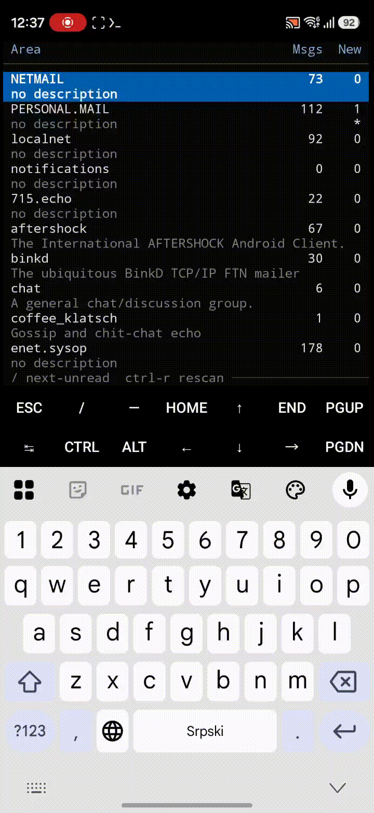

```
,d$$$$b.              db                         ,@$$$$@b       db QO   db
$$'  `$$              $$                         @$             $$      $$
$8    8$ ,88@q.,p@88. $$d%@8%. ,o@$$@@. ,d@$$@q. $b       ,o@$$$$$ && d#@@%D
$$8@@8$$ $$   $$   $$ $$'  `@$ $@    @8 $$'  `8' $$$0f    $$'  `$$ $$   $$
$$    $$ $$   $$   $$ $$    B$ $$$$$B@' $$       $$       $$    $$ $$   $$
$$    $$ $$   $$   $$ $$.  ,@B $$.      $$       @$       Q@.  ,$@ $$   $@.,J@
$$    $$ $$   $$   $$ `Q$$$$@' `@$$$$Q: $$       `@$$$$@% `Q@$$@@' $$   `@$$0'
```

[](https://github.com/jegornet/amberedit/actions/workflows/ci.yml)

A terminal-based (TUI) [FidoNet](https://www.fidonet.org/) mail editor for Linux and macOS.



## Features

- **Mouse/taps support and adaptive UI**: finally make your phone's SSH client
  a suitable place to read FTN mail
- **Charsets encode/decode**: supported UTF-8 and legacy charsets like CP866,
  CP437, LATIN-1 etc. UTF-8 terminal locale is recommended.
- **Squish, JAM and Fido `*.msg`** messagebase format, with the areas taken from
  your tosser's config (fidoconfig, `areas.bbs` or `squish.cfg`), and from
  `area … endarea` blocks of your own for manual area configuration.
- **Writing**: reply, reply into another area, forward, move or copy a message
  elsewhere, change one that is already in a base, delete. Carbon copies and
  crossposts (`CC`/`XC`/`XP` lines like in GoldED). GoldED-style templates.
- **Text and UUE import/export**: read a file into a message as text or uuencoded,
  write a message out to a text file, or take the uuencoded files back out of one.
- **Nodelists and pointlists**, automatically compiled at startup when they change
- **Echolists**, compiled at startup on the same terms
- **Color Themes** in the terminal's own 256 colours
- **Twits** — FidoNet just won't be FidoNet without them.
- **ANSI graphics** and **Renegade/Telegard BBS color codes** support — experimental.
<details>
<summary>ANSI graphics demo</summary>

</details>

## Building and installing

Every tagged release carries built packages —
[Releases](https://github.com/jegornet/amberedit/releases) has RPMs for RHEL 8, 9
and Fedora, debs for Debian stable and Ubuntu 22.04 and 24.04, and tarballs for
macOS on both architectures.

Building it yourself needs CMake ≥ 3.16, a C++17 compiler, git, iconv, zlib,
tl::expected and the wide-character ncurses — [INSTALL.md](INSTALL.md) has the commands, and what
differs on macOS.

## Running

```bash
cp amberedit.cfg.example ~/.ambereditrc   # then fix up the paths
amberedit                                 # or: amberedit -c some/amberedit.cfg
```

```
-c, --config <path>   the config to read
    --compile         compile the nodelists and echolists before starting,
                      changed or not
-h, --help            usage
-V, --version         the version AmberEdit signs its messages with
```

### Keys

There is no help screen, so here they are. Enter accepts a dialog and Esc closes
one; the mouse works on every screen, and the wheel scrolls a line at a time.
**Ctrl-Q** quits from anywhere. Every key below that runs a command
can be moved — see [Rebinding the keys](#rebinding-the-keys) — and the last row
names the main ones under whatever keys they are on (`hint_bar`), as many as the
window holds. Clicking one presses that key. Which commands each screen's row
names is yours to write down as well — `arealist_hints`, `msglist_hints`,
`reader_hints` and `compose_hints`, one list of commands each.

**Area list**

| Key | What it does |
|---|---|
| `↑` `↓` `PgUp` `PgDn`, `Home` `End` | move |
| `Enter`, click | open the area under the cursor |
| any letter | search by area tag; `Backspace` edits the query, `Esc` closes it |
| `/` | go to the next area with unread messages, round the end of the list |
| `Ctrl-R` | read the tosser config and every base again |
| `Esc` | quit |

**Message list**

| Key | What it does |
|---|---|
| `↑` `↓` `PgUp` `PgDn` `Space` | move |
| `Home`, `End` | first, last |
| `Enter`, `→`, click | open the message |
| `Esc` `←` `Backspace` | back to the area list |

**Reader**

| Key | What it does |
|---|---|
| `←` `→` | previous, next message — off either end leaves the area (`reader_edge_exit`) |
| `↑` `↓` `PgUp` `PgDn` `Space` `Shift+Space` | scroll the message |
| `Home`, `End` | top, bottom |
| `q` / `F4` | reply |
| `e` | write a new message |
| `n` / `F5` | reply into another area |
| `Alt-Q` | reply, addressed to whoever the message was written to |
| `m` | forward, move or copy into another area |
| `c` / `F2` | change the message |
| `d` / `Del` | delete it (asks first) |
| `-` `+` / `=` | up and down the thread |
| `Ctrl-F` / `F6` | look for a message in the area |
| `l` / `F9` | the list of messages |
| `k` | show the kludges — a reply then quotes them, a forward carries them |
| `b` | the scrollbar |
| `i` | what the base holds about the message |
| `w` / `F7` | write the message out to a file |
| `Ctrl-N` / `F10` | the nodelist |
| `Space` | show a message blanked as a twit |
| `Esc` `Backspace` | back to the area list |

**Editor**

| Key | What it does                                                       |
|---|--------------------------------------------------------------------|
| `Tab` `Shift-Tab` | the ring: the fields, the subject, the attributes button, the text |
| `Enter` | the next field, then down into the text                            |
| `Alt-H` | edit header                                                         |
| `Ctrl-S` / `F2` | save (asks first)                                                  |
| `Esc` | drop the message (asks first)                                      |
| `Ctrl-F` | edit message attributes                                         |
| `Ctrl-O` | open a file to insert as text or uuencoded                    |
| `Ctrl-Y` | delete the line — or the button beside it, on the right-hand edge   |
| `Ctrl-U` | put back the last line `Ctrl-Y` took, above the cursor              |
| `Ctrl-D` | delete the quoted text after the cursor                            |
| `Ctrl-W` / `Alt-Backspace` | delete the word before the cursor                     |
| `Alt-B` `Alt-F` / `Alt+←` `Alt+→` | by words                                         |
| `Ctrl-A` `Ctrl-E` | to the start of the line and to its end, as `Home` and `End`     |

### Rebinding the keys

A `keys` line names a layout:

```
keys ~/ftn/etc/amberkeys.cfg
```

A line of that file is a key and a command:

```
l    reader.list
F2   reader.change
```

**The file is the layout entire.** A command it does not name has no key at all,
so copy `amberkeys.cfg.example` — which is the defaults above, written out — and
edit that rather than starting from an empty file. A command may be named on
several lines and then answers to each of those keys.

Keys are written as a single character (`l`, `G`, `/`, `+` — case tells two
apart), a function key (`F1` to `F12`), `Del`, `Ctrl-` and a letter, or `Alt-`
and a letter, an arrow or `Backspace`. Two screens may share a key, as `F2`
does between the reader and the editor; two commands of one screen may not, and
a layout that tries says which line clashes with which.

**Moving about is not bindable**: the arrows, `PgUp` and `PgDn`, `Home` and
`End`, `Space`, `Enter`, `Esc`, `Backspace` and `Tab` mean the same thing on
every screen — bare, that is: `Alt-Left` and `Alt-Backspace` are chords of their
own and may be bound — and the dialogs answer for themselves entirely. Naming
one of them is an error rather than a line quietly dropped.

The commands are `app.quit`; `arealist.next-unread` and `arealist.rescan`;
`reader.` `reply`, `reply-elsewhere`, `comment-reply`, `new`, `forward`, `change`,
`delete`, `export`, `find`, `list`, `info`, `nodelist`, `kludges`, `scrollbar`,
`thread-up` and `thread-down`; and `compose.` `save`, `attributes`, `import`,
`header-back`, `delete-line`, `restore-line`, `delete-quote`, `delete-word`,
`word-left`, `word-right`, `line-start` and `line-end`.

### Finding a message

**Ctrl-F (or F6) in the reader** asks what to look for and how much of a message
to read it against — the header and the text, or the header alone, the header
being the From and To names, the addresses under them and the subject. The search
runs from the message on screen to the end of the area; the same words looked for
again go on from the message after the one that was found, so Ctrl-F, Enter,
Ctrl-F, Enter walks from occurrence to occurrence. It stops at the end of the
area rather than wrapping round to the front.

The message found opens scrolled to the occurrence, with every occurrence in it —
in the body and in the header block alike — on the theme's `found` fill. Moving
to another message takes the highlight off.

**Case is folded by the charset the message declares** — its `CHRS` kludge, or
the area's `default_charset` where it carries none — rather than by the locale. **CP866
carries the Russian language support quirks** with it: a message written in it may spell Н, р and
у with the Latin H, p and y, so those pairs are folded together — and only there,
since in a western area they are six different letters.

### Carbon copies and crossposts

Two commands you write into the message itself, as GoldED takes them. Each has
to begin its line, and neither is read in a quoted line:

```
CC: Ivan Ivanov, 2:5020/1234, #Vasya Pupkin, @friends.lst
XC: ru.* ru.linux, #ru.talk
```

`CC:` sends a copy of the message to everybody it names — a name the nodelist
knows, an address whole or in part (`/1234` for a node in your own net), an
`address_macro`, or a file of names — and `XC:`/`XP:` posts it in every echo its
masks name. A `#` makes the copy without naming its recipient in the message.
You are asked before either is carried out, and a name nobody could find leaves
its line where you wrote it rather than losing what you asked for.

Copies of a message written in an echo go to the netmail area that echo's
`reply_to_area` names; what the message keeps in place of the commands is
`compose_cc_list` and `compose_xc_list`. See `amberedit.cfg.example`.

### The nodelist

**Ctrl-N (or F10) in the reader** opens the nodelist on whoever wrote the message
on screen.
The Lookup line takes an address, whole or in part — `2`, `2:240`, `2:240/1120`
— or any part of a sysop's name, and Enter walks through everything it finds.
The list is the whole nodelist either way: a node is worth as much for its
neighbours as for itself.

**Writing netmail**, Enter on a half-filled To row asks the nodelist for the
other half: a name with no address under it lists the nodes of that name,
closest first, and an address with no name above it shows the nodelist at that
address. Part of a name is enough — Enter on a row addresses the message to that
node, name and address both, with the name spelled as the nodelist spells it,
and moves on to the subject.

**The header block** in the reader says where the message was written, in the
rule under it (`show_location`); a point no pointlist lists is placed where its
boss is, which is also what the nodelist box opens on.

The nodelists themselves are compiled at startup whenever they have changed, so
there is nothing to run by hand; `amberedit --compile` compiles them anyway.
Which files, under what patterns, and where the compiled one goes — see
`amberedit.cfg.example`.

### Echolists

An echolist says what an echo is — the tag and a description, agreed across the
network rather than written into your tosser config. Point `echolist` at the
lists you keep, one line each, either a `.lst`/`.na` or a zip archive of them,
and the descriptions turn up in the area list's description column and in the
`@CDESC`/`@ODESC` template tokens.

The filename may be a wildcard — `echolist ~/ftn/echolist/echo*.zip` takes the
newest file it matches, which is what to write when the list you are sent carries
its month in its name.

An echolist that is not in your locale's charset says which it is on the same
line (`echolist ~/ftn/echolist/echo50.lst CP866`), and
`arealist_description_priority` says which description an echo with two of them
is shown by. As with the nodelists, they are compiled at startup whenever they
have changed and there is nothing to run by hand. See `amberedit.cfg.example`.

### Twits

Whom you would rather not read: names, FTN address patterns and subjects, listed
globally or inside a `group … endgroup` block, and `twit_mode` says what becomes
of one — from a notice in place of the text to deleting it as the area opens.
See `amberedit.cfg.example`.

### Themes

A colour in a theme is a number from 0 to 255 — an entry in the terminal's own
256-colour palette, the same numbering `ESC[38;5;Nm` uses. Entries 0–15 are the
colours you have already chosen for everything else you run.

`themes/black.cfg` is the built-in palette written out — what AmberEdit draws
with when the config names no theme, and the file to copy and edit.
`themes/blue.cfg` is a navy screen with sky blue on it, `themes/white.cfg` a
near-white one with near-black on it for a light terminal, and
`themes/16_colors.cfg` uses nothing above 15, so it is exact even on a console
that has only those; a terminal with fewer colours than a theme asks for gets the
nearest it has.

### Configuration

Without `-c` the config is looked for in `$AMBEREDIT_CONFIG`, `./amberedit.cfg`
and `~/.ambereditrc`, in that order. Every setting, what it takes and what it
defaults to, is in `amberedit.cfg.example`.

## License

GPL-2.0-or-later — see [LICENSE](LICENSE).
